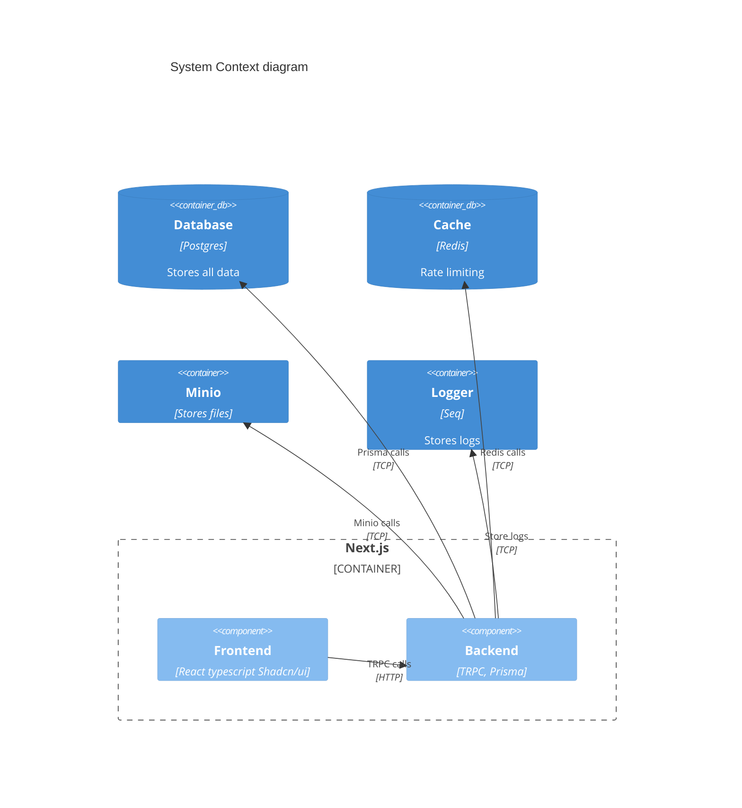

# Architecture

Dans le cadre de ce projet, plusieurs technologies sont utilisées pour répondre aux besoins de l'application.

- [Next.js](https://nextjs.org/): Framework React pour le rendu côté serveur.
- [Redis](https://redis.io/): Base de données en mémoire pour le rate limiting.
- [Postgres](https://www.postgresql.org/): Base de données relationnelle pour stocker les données.
- [Minio](https://min.io/): Stockage d'objets pour les fichiers.
- [Seq](https://datalust.co/seq): Stockage des logs.

Dans la phase de développement, nous utilisons Docker pour lancer les services nécessaires. Des créderntials par défaut sont utilisés pour les services. Ceux-ci ne doivent pas être utilisés en production.
