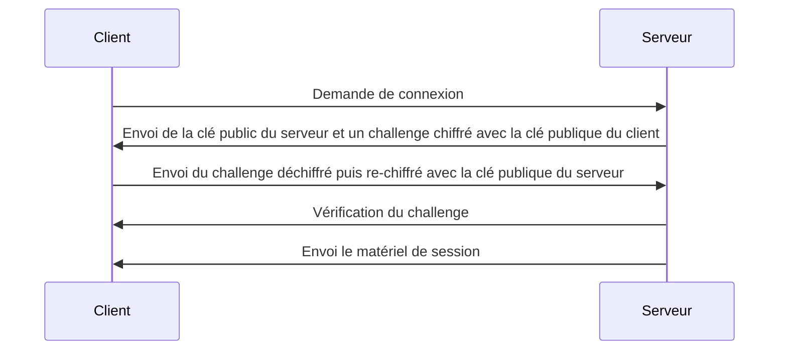
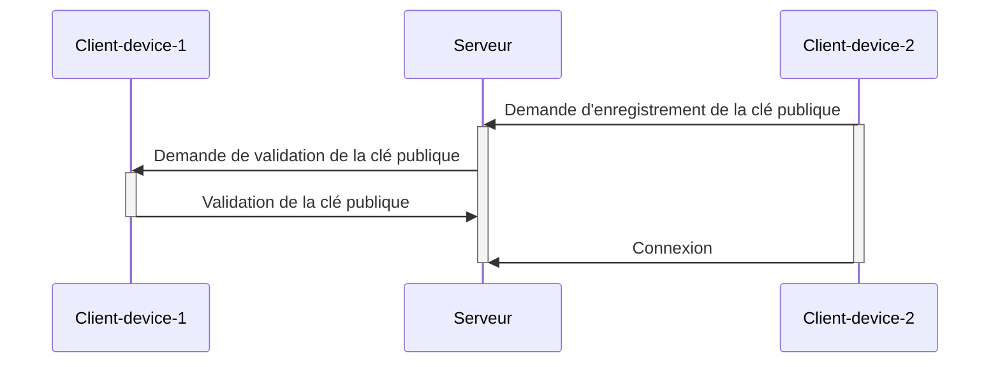

# Authentification avec clé asymétrique

L'authentification avec clé asymétrique est une méthode d'authentification qui utilise une paire de clés, une clé privée et une clé publique, pour authentifier un utilisateur. La clé privée est utilisée pour déchiffrer les données chiffrées par la clé publique. La clé publique est utilisée pour chiffrer les données qui peuvent être déchiffrées par la clé privée.

On peut trust le fait de discuter avec le bon serveur en vérifiant la signature de la clé publique du serveur avec une autorité de certification (CA). La CA est une entité de confiance qui signe les clés publiques des serveurs pour garantir leur authenticité. Celle-ci n'authentifie pas l'application mais le serveur, plusieurs applications peuvent être hébergées sur un même serveur. Pour authentifier l'application, il faut utiliser une autre pair de clés asymétriques qui sera signée par la clé privée du serveur. Ce qui crée une chaine de confiance.

L'authentification se passe en plusieurs étapes :

Pourquoi avoir re-chiffré le challenge avec la clé publique du serveur ? Cela permet d'éviter un clair chiffré qui pourrait être intercepté et réutilisé par un attaquant en cas de compromission de la connexion ou du protocole de communication.

# Connection depuis un autre client

