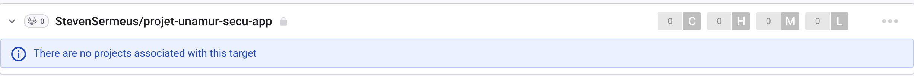

# Snyk

Snyk est un outil de sécurité qui permet de trouver et de corriger les vulnérabilités dans les dépendances de vos projets ainsi que dans le code source.

Il est important de ne pas se fier uniquement à Snyk pour la sécurité de votre projet. Il est important de suivre les bonnes pratiques de sécurité et de tester régulièrement votre code.

Ce service à été activé sur le repertoire du projet le 29 mars 2024.

Snyk ajoute un jobs dans le pipeline du projet qui permet de faire ses vérifications.

## Vulnérabilités trouvées

- Aucune
