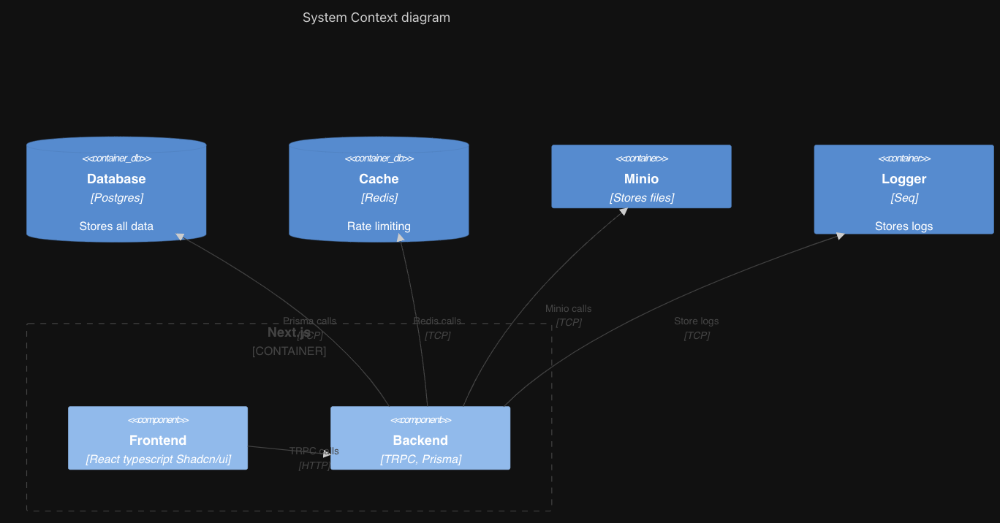

# Architecture physique

Pour répondre à la problématique de l'énoncé tout en respectant les contraintes, nous avons utilisé une architecture client-serveur où le serveur ne peut pas être considéré comme un acteur de confiance. De ce fait, il a été nécessaire de mettre en place un chiffrement de bout en bout des informations sensibles. De plus, la sécurité des différents composants de l'application devait être assurée. Pour cela, nous avons utilisé différentes technologies pour chaque composant de l'architecture.

Comme le montre le schéma ci-dessus, l'architecture physique de notre application est composée de plusieurs éléments :

- **Base de données** : Celle-ci permet de stocker les informations des utilisateurs à long terme.

- **Reverse proxy** : Il permet d'assurer la connexion HTTPS entre le client et l'infrastructure. Nous avons utilisé Nginx, il assure également la connexion en HTTPS entre le serveur et le client.

- **Serveur de fichiers** : L'utilisateur pouvant être malveillant, nous avons décidé de ne pas stocker les fichiers sur le serveur principal. Nous avons délégué cette tâche à un serveur de fichiers dédié, Minio.

- **Serveur de logs** : Pour avoir un stockage de log fiable et sécurisé, nous avons utilisé un serveur de logs dédié, Seq.

- **Base de données clés valeurs** : Celle-ci permet d'effectuer des opérations de lecture et d'écriture rapides et nous a été utile pour effectuer du rate limiting sur les différentes routes de l'application. Nous avons utilisé Valkey, qui est le fork open-source de Redis.

- **Next.js** : Il s'agit du coeur de l'application, il permet de gérer les différentes routes et de générer les pages côté serveur.
