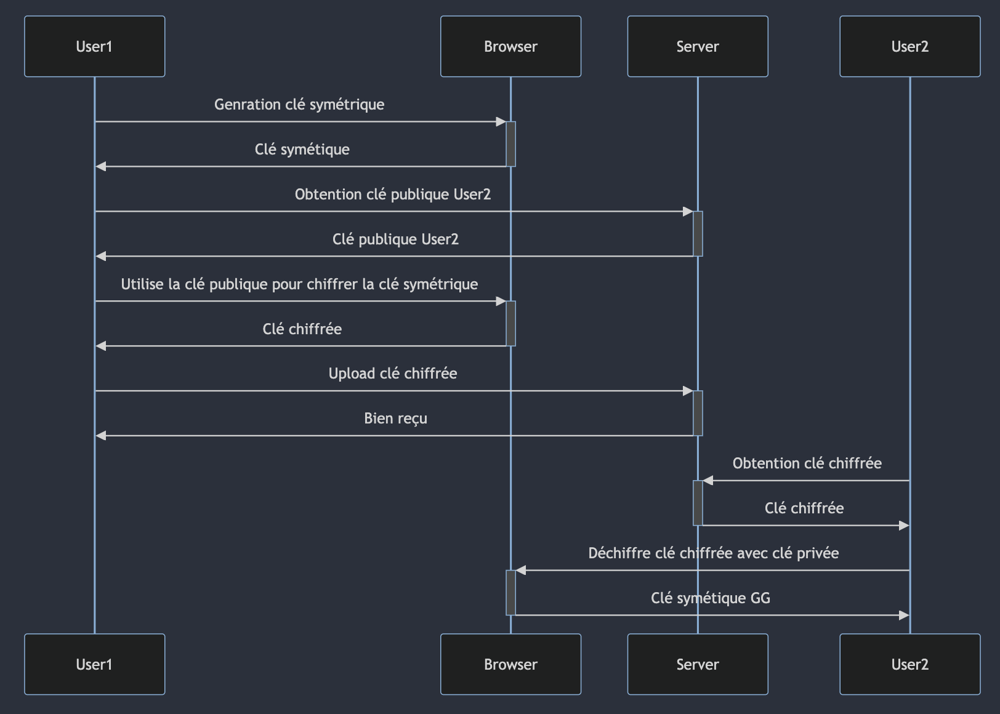

## Partage des photos et albums

### Partage d'une photo

Concernant le partage d'une photo, il faut d'abord récupérer les clés publique de l'utilisateur avec qui on veut partager la photo. Pour cela, il y a une requête faite au serveur afin de récupérer toutes les clés publique de chaque device de l'utilisateur à qui on souhaite partager notre photo. Le serveur va alors nous répondre avec un dictionnaire contenant chaque id de chaque device avec sa clé publique correspondante. Une fois les clés publique récupérées, la clé symétrique utilisée pour chiffrer la photo va alors être chiffrée autant de fois qu'il existe de clé publique. Il y a alors un dictionnaire renvoyé au serveur contenant l'id de chaque device avec le chiffrement de la clé symétrique par device.

    deviceID1 = chiffrementKeySymétricDeviceID1
    deviceID2 = chiffrementKeySymétricDeviceID2

De plus, il est tout à fait possible de partager une photo qui n'est présente dans aucun album.

Comme le montre le diagramme ci-dessus, l'utilisateur avec qui la photo est partagée peut tout simplement déchiffrer la clé symétrique chiffrée avec sa clé privée stockée localement afin d'avoir accès à la valeur de la clé symétrique. Une fois cette valeur récupérée, il peut alors déchiffrer la photo et y avoir accès.

### Partage d'un album

Concernant le partage d'un album, il s'agit du même mécanisme que celui décris précédemment concernant le partage d'une photo. Il y a cependant le nom de l'album qui lui aussi est chiffré via la clé publique du device de l'utilisateur. Pour cela, il y a d'abord une requête au serveur pour récupérer les clés publique de l'utilisateur afin de chiffrer le nom de l'album et ensuite une requête afin de récupérer les clés publique de l'utilisateur avec qui on souhaite partager l'album. Comme expliqué précédemment, chacune des clés symétrique va alors être chiffrée par les clés publiques existantes.

Comme expliqué précédemment, l'utilisateur avec qui l'album est partagé va pouvoir déchiffrer le nom de l'album via sa clé privée.
