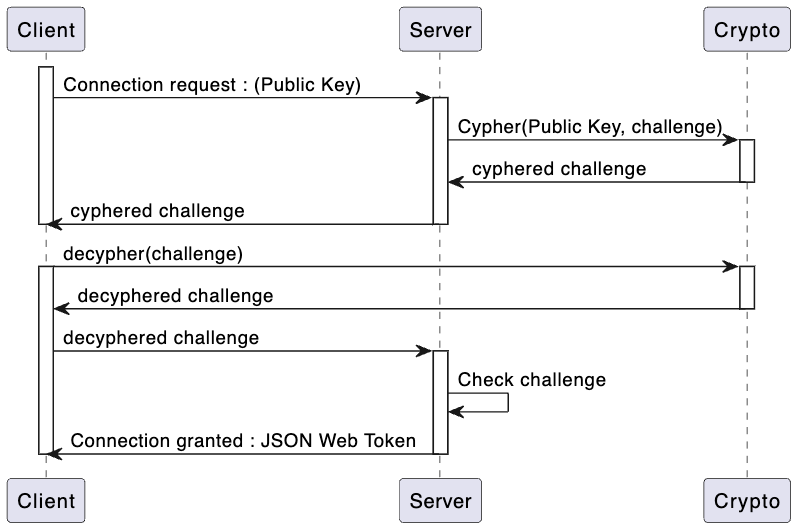

## Authentification

{whidth=70%}

Comme le montre le diagramme ci-dessus, lorsqu'un utilisateur souhaite s'authentifier, il va envoyer au serveur la clé publique du device depuis lequel il essaye de se connecter. Lorsque le serveur reçoit cette clé publique, il vérifie d'abord si elle existe et va alors renvoyer à l'utilisateur un challenge si cette clé publique existe bien dans la base de données. Ce challenge est alors uniquement déchiffrable avec la clé privée correspondante. Une fois le challenge déchiffré au serveur, le serveur vérifie bien si le challenge est correct ou non. Si le challenge est correct, alors l'utilisateur peut se connecter et reçoit un JWT (Json Web Token). Dans le cas contraire, l'utilisateur ne peut se connecter.

\newpage

## Management des devices

L'application permet à chaque utilisateur d'ajouter autant de devices qu'il le souhaite. Quand un utilisateur ajoute un device, une paire de clés publique-privée est générée pour ce device. Cela se produit tout d'abord lorsque l'utilisateur va créer son compte pour la première fois, une paire de clés publique-privée est alors créé pour ce device. Ensuite, une fois connecté sur son device, l'utilisateur va avoir la possibilité d'ajouter d'autres devices. Une fois la paire de clés générée, l'utilisateur va devoir valider le device qu'il vient d'ajouter via un device de confiance. C'est-à-dire un device déjà "Trust" (de confiance) par l'utilisateur.

Par exemple, si un utilisateur souhaite ajouter un 2e device, il va devoir, sur son 1er device, cliquer sur le bouton "Trust" afin d'affirmer qu'il a confiance en ce device. Une fois cela fait, il va pouvoir se connecter à ce 2e device.

Une fois qu'un device est "Trust", il faut alors que l'utilisateur puisse avoir accès à ses photos sur ce nouveau device. Pour cela, chaque clé symétrique pour chaque photo va être chiffrée avec la clé publique de ce nouveau device. Pour les noms d'album, ils seront directement chiffrés avec la clé publique du device.

Dans le cas où un utilisateur décide de ne plus "Trust" un device car il l'a perdu où il n'y a plus accès, alors on ne peut ni avoir accès à ce device, ni aux photos et albums accessibles précédemment via ce device.

Lors de chaque requête vers le serveur, on vérifie d'abord si le device en question est "Trust" (de confiance). Dans notre code, chaque procédure est une "protectedProcedure" qui s'assure que le device qui est en train d'effectuer une requête est "Trust". Il existe des exceptions concernant le login et la connexion, sinon il serait impossible d'accéder à l'application.
